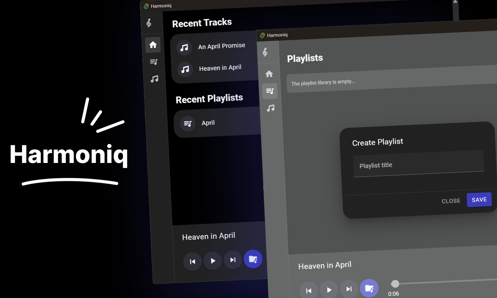

# Harmoniq Music Player with Vue.js 3 and Tauri (v2)

## Overview
This project is a lightweight and elegant music player application built with modern web and desktop technologies. It combines the versatility of Vue 3 (Composition API), the state management power of Pinia, the robust UI capabilities of Vuetify, and the typing benefits of TypeScript. Vue Router provides seamless navigation, while Tauri enables the app to run as a desktop application.

### Key Features
1. **Multi-file Support**:
    - Allows users to open multiple audio files simultaneously using an intuitive file dialog.
    - Supported formats include `.mp3`, `.wav`, and `.ogg`.

2. **Track Library**:
    - Displays all imported tracks in an organized library.
    - Supports browsing and selecting tracks dynamically.

3. **Playlist Management**:
    - Users can create, edit, and manage playlists.
    - Playlists allow custom ordering of tracks for personalized playback.

4. **Playback Controls**:
    - Play, pause, skip to the next track, and return to the previous track functionalities.
    - Smooth track transitions in the library.

5. **Intelligent Duplication Handling**:
    - Avoids adding duplicate tracks to the library or playlists to maintain a clean and efficient experience.
    - Tracks are uniquely identified to prevent redundancies.

6. **User-Friendly Design**:
    - Leveraging Vuetify for an intuitive, responsive, and visually appealing user interface.
    - Consistent styling across all components.

7. **Desktop Integration**:
    - Utilizes Tauri for packaging and running the app as a desktop application.
    - Provides native-like performance with a lightweight footprint.

## Technologies Used
- **Vue 3 (Composition API)**: For building modular and reusable components.
- **Pinia**: State management to synchronize playback state, library, and playlists.
- **Vuetify**: For a material design-inspired, responsive UI.
- **TypeScript**: Ensures type safety and helps maintain clean, readable code.
- **Vue Router**: Facilitates seamless navigation between library, playlists, and playback views.
- **Tauri**: Powers the app as a lightweight desktop application.

## Functionality Breakdown
1. **File Handling**:
    - Users can load multiple tracks at once.
    - Tracks are processed, metadata is extracted, and displayed in the library.

2. **Playback Navigation**:
    - Skip to the next or previous track in the library with circular navigation support (i.e., wraps around to the first track if the current track is the last, and vice versa).
    - Real-time playback controls with play and pause functionality.

3. **Playlist Creation**:
    - Add tracks from the library to custom playlists.
    - Playlists allow easy management and reordering of tracks.

4. **Dynamic Library Updates**:
    - Automatically updates the library when new tracks are added, ensuring no duplicates are introduced.

## Advantages
- **Optimized Performance**: Uses efficient algorithms and avoids unnecessary re-renders to ensure smooth performance.
- **Scalability**: Built with modular components, making the application easy to scale and maintain.
- **Cross-Platform**: Thanks to Tauri, the app can run on multiple desktop environments like Windows, macOS, and Linux.

## Usage
1. Open the app and import your audio files into the library.
2. Use the playback controls to play, pause, or navigate through tracks.
3. Create and manage playlists from your imported tracks.
4. Enjoy uninterrupted music playback with a clean and user-friendly interface.

## Future Improvements
- Enhance metadata extraction for richer track information.
- Implement audio visualization during playback.
- Introduce theme customization options.
- Add support for drag-and-drop file importing.
